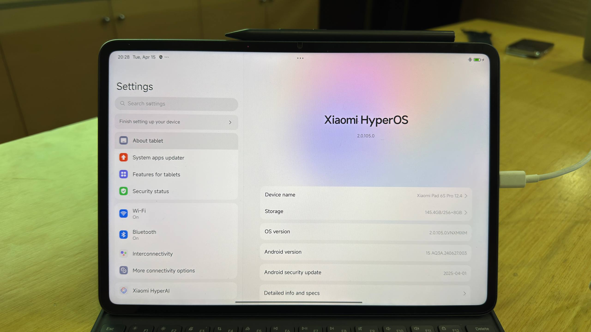

# Warning
We're not responsible for bricked devices, missing recovery partitions, dead xiaomi factoryline workers cowboys, dead microSD cards, dead pmics, dead ram, dead display ics, dead cpus, any xiaomi shenanigans, dead cats or dogs, nuclear wars or you getting fired because you forgot to boot back in to android for the alarm.

All the files here have been contributed by other users, here you will find a guide with the working files we managed to get. This is a delicate process, do it under your own risk and follow all the steps carefully.

**IF YOU AREN'T COMFORTABLE MODDING YOUR TABLET OR ITS PARTITION TABLE OR YOU ARE PARANOID OF BRICKING YOUR DEVICE CLICK AWAY NOW!!! YOU HAVE BEEN WARNED, YOU ARE ON YOUR OWN IF YOU BRICK YOUR DEVICE!!! AGAIN! YOU HAVE BEEN WARNED!!!**


# Installation Guide
Please follow the guide carefully

1. Make sure you have unlocked the bootloader on your device and make sure only Android OS is installed.
2. Look for the latest workflow run (marked with 🟢)
3. Download the desired image:
 - xiaomi-sheng-none_*.zip (minimal system)
 - xiaomi-sheng-plasma_*.zip (KDE Plasma)
 - xiaomi-sheng-gnome_*.zip (GNOME Shell)
 - xiaomi-sheng-gnome_mobile_*.zip (GNOME Shell Mobile)
 - xiaomi-sheng-plasma_mobile_*.zip (KDE Plasma Mobile)
 - xiaomi-sheng-lomiri_*.zip (KDE Plasma Mobile)
 - xiaomi-sheng-kernel_*.zip (kernel packages)
4. Extract ZIP


# Single Boot
1. Boot to bootloader
    ```bash
	adb reboot bootloader
	```
2. Erase dtbo
    ```bash
	fastboot erase dtbo_a
    fastboot erase dtbo_b
	```

3. Flash boot image
    ```bash
	fastboot flash boot_ab boot-xiaomi-sheng.img
	```

4. Flash rootfs image
    ```bash
	fastboot flash userdata rootfs-xiaomi-sheng-*.img
	```

5. Reboot
    ```bash
	fastboot reboot
	```

# Dual Boot
1. Boot to TWRP
    ```bash
	adb reboot recovery
	```

2. Download parted file in this repo
4. Push parted file to android storage 
	```bash
	adb push <path/to/parted> /sdcard
	```
5. Enter adb shell
	```bash
	adb shell
	```
6. Create linux partition
	```bash
	chmod +x /sdcard/parted
	/sdcard/parted /dev/block/sda
	```
7. delete userdata partition, note the number (far left), in my case, userdata is at number 29
	```bash
	print
	rm 29
	```
8. Create userdata and linux partition (userdata 128GB and linux 128GB)
	```bash
	mkpart userdata ext4 12.7GB 140.7GB
	mkpart linux ext4 140.7GB -0MB
	```

9. Check the partition that has been created
	```bash
	print
	```

10. You will see 29 for userdata and 30 for linux
11. Exit from parted
	```bash
	quit
	```
12. Exit from shell
	```bash
	exit
	```
13. Boot to bootloader
    ```bash
	adb reboot bootloader
	```

14. Erase dtbo
    ```bash
    fastboot erase dtbo_b
	```

15. Flash boot image
    ```bash
	fastboot flash boot_b boot-xiaomi-sheng.img
	```

16. Flash rootfs image
    ```bash
	fastboot flash linux rootfs-xiaomi-sheng-*.img
	```

17. Slot B activation
    ```bash
	fastboot set_active b
	```

18. Reboot
    ```bash
	fastboot reboot
	```

# Switch OS
1. From Android to Linux
	- GUI (Requires rooting)
		- Download app [Here](https://github.com/capntrips/BootControl/releases)
		- Install app
		- Open app
		- Activate Slot B and reboot

	- Bootloader (no root, requires PC)
		- Boot to bootloader
		- Slot B activation
		```bash
		fastboot set_active b
		fastboot reboot
		```

2. From Linux to Android
	- qbootctl
		- Open terminal
		- Slot A activation
		```bash
		sudo qbootctl -s a
		sudo reboot
		```

	- Bootloader (Requires PC)
		- Boot to bootloader
		- Slot A activation
		```bash
		fastboot set_active a
		fastboot reboot
		```
# 🔐 Login Credentials
Default System Credentials

Username: user
Password: 147147 (for initial setup)

# Tips if you use Gnome Shell Mobile
1. Use gnome extensions to force phone mode, you can follow the guide [Here](https://github.com/vixalien/force-phone-mode)

# Screenshot
<div align="center">
  
  <p><em>Xiaomi Pad 6s Pro HyperOS</em></p>
  <br>
	
  <p><em>Xiaomi Pad 6s Pro PostmarketOS</em></p>
    <br>
	
  <p><em>Xiaomi Pad 6s Pro with 6.17 kernel</em></p>
</div>